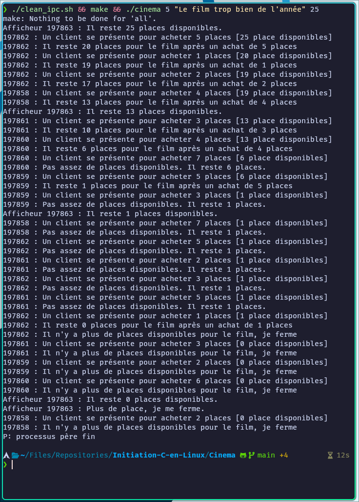

**Sujet :**<br> 
Simulation du système de vente de places de cinéma.<br> 
Chaque caisse est indépendante des autres mais les caisses vendent indépendamment les places <br> 
Chaque caisse a connaissance du nombre de places restantes et ne peut vendre que les
places restantes.<br> 
Le public dispose d’un écran qui affiche le nombre de places restantes.

<br><hr><br>

**Travail demandé :**  
Par groupe de 2, 3 ou 4 personnes écrire un programme qui prend en
paramètre :
- le nombre de caisses,
- le titre d’un film
-  le nombre de places pour ce film.<br> 

Ce programme va engendrer les processus suivants :
- autant de processus caisse que de caisses demandées
- un processus afficheur mis à jour toutes les 5 secondes
Les caisses simuleront des clients (achat d’un nombre aléatoire de places compris entre 1
et 7) avec un temps de traitement aléatoire compris entre 1 et 3s.<br> 
Dès que le nombre de places restantes est égal à zéro, les caisses ferment (les processus
se terminent), seul l’afficheur reste actif.
<br> Si le nombre de place demandées est supérieur au nombre de places restantes, on passe
au client suivant.

<br><hr><br>

Execution :<br> 

Pour exécuter le programme, il est nécéssaire de compilé les fichiers sources puis de lancer `cinema` avec les argument attendus.<br> 
*./cinema **<nb_de_caisses>** **<titre_film>** **<nb_places>***<br> 
Le script `clean_ipc.sh` permet de supprimer les fichers générés par le programme.<br><br>
Ci dessous la commande que j'ai utilisé pour tester le programme (*à lancer dans le repertoire `Cinema`*) : 
```bash
./clean_ipc.sh && make && ./cinema 12 "Le film trop bien de l'année" 250
```
<br><hr><br>

**Notes par rapport au sujet :**<br>

- Par défaut l'afficheur est mis à jours et affiche son statut toutes les 3 secondes.<br> 
Pour modifier ce temps, il faut modifier la valeur de `delais` à la ligne 30 de `afficheur.c` puis relancer le programme avec la commande du dessus.<br>

- Une fois qu'il n'y a plus de place les guichets ferment et également l'afficheur.<br>
Point de vue d'un cinéma, ce n'est peut être pas très pertinent de fermé l'afficheur, mais dans le contexte d'un programme, j'ai préféré le faire pour éviter de laisser des processus tourner inutilement.<br>
Pour supprimé la fermeture de l'afficheur ce qui le laissera tourner après avoir vendu toutes les places, il suffit de commenter la ligne 55 à 59 de `afficheur.c` puis recompiler le programme.<br>

- Une fois la dernière place vendu, le programme attend que les processus caisses se terminent avant de terminer le programme père.<br>



