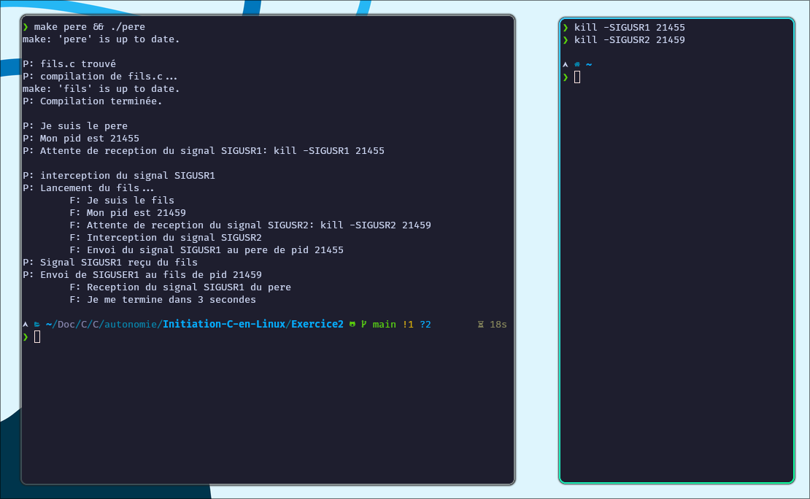

# Initiation-C-en-Linux

Code fourni dans le cadre du module de C en Linux de Mr Malinge à IPI Lyon. <br><br>
Cette page contient les exercices réalisés en cours, le tp noté est sur une page dédiée.

### Sommaire

- [Exercice 1](#exercice-1)
- [Exercice 2](#exercice-2)
- [Pere_Fils_With_Arg](#pere_fils_with_arg)
- [TP Noté: Cinema](Cinema)

<hr>

### Exercice 1

##### *Enoncé :*

Vous devez écrire un programme qui affiche son PID et qui attend la réception du signal
SIGUSR1. À réception de ce signal, le processus crée un fils, ce fils exécute un programme
de votre choix (eog, evince, chrome, firefox…). Le père attend la mort du fils
Amélioration : on pourrait imaginer que à chaque réception du signal SIGUSR1, le
programme se comporte encore de la même manière.

##### *Build :*

Lancer le code avec la commande suivante dans le repertoire de l'exercice 1

```bash
make exercice1 && ./exercice1
```

##### *Notes :*

- Pour favoriser la compatibilité, j'ai fait le choix d'utiliser le navigateur Firefox pour l'exécution du programme
  fils,
  à la place de eog.


- Le programme affiche son PID et la commande à executer pour envoyer le signal.


- Il est possible d'envoyer le signal plusieurs fois pour lancer plusieurs instances du programme fils, qui s'ouvriront
  dans des onglets différents du navigateur.


- Après envoi du signal depuis un autre terminal, le programme fils se lance et affiche une page web de test en
  navigation privée.


- Pour fermer le programme exercice1 proprement, le signal à envoyer est donnée dans le terminal lors de l'exécution du
  programme.


<hr>

### Exercice 2

##### *Enoncé :*

Vous devez écrire un programme qui affiche son PID et qui attend la réception du signal
SIGUSR1. À réception de ce signal, le processus crée un fils, le fils affiche son pid puis
attend la réception du signal SIGUSR2. À réception de ce signal, le fils envoie SIGUSR1 au
père qui renvoie au fils SIGUSR1. Lors de la réception de SIGUSR1, le fils affiche qu’il va se
terminer dans 3 secondes, le père attend la mort du fils et se termine.

##### *Build :*

Lancer le code avec la commande suivante dans le repertoire de l'exercice 2

```bash
make pere && ./pere
```

##### *Notes :*

- Le programme s'occupe de vérifier que fils.c est présent avant de le compiler et de l'executer par l'intermédiaire de
  la fonction compile_fils().


- La console affiche les pid ainsi que les commandes à executer pour envoyer les signaux. Et donne l'information sur la source
  du retour console (P: pour pere et F: pour fils).





<hr>

### pere_fils_with_arg

J'en ai profité pour ajouter un exercice à faire en temps de classe, qui traite sur les forks avec des arguments.

##### *Build :*

Lancer le code avec la commande suivante dans le repertoire de l'exercice pere_fils_with_arg, en adaptant le nombre de fork.
```bash
make pere_fils_with_arg && ./pere_fils_with_arg 7
```

  - Génère un nombre de fork égal à l'argument passé en paramètre. 
  - Chaque fils affiche son pid et celui du père.
  - Le père attend la mort de tous ses fils avant de se terminer.

  


